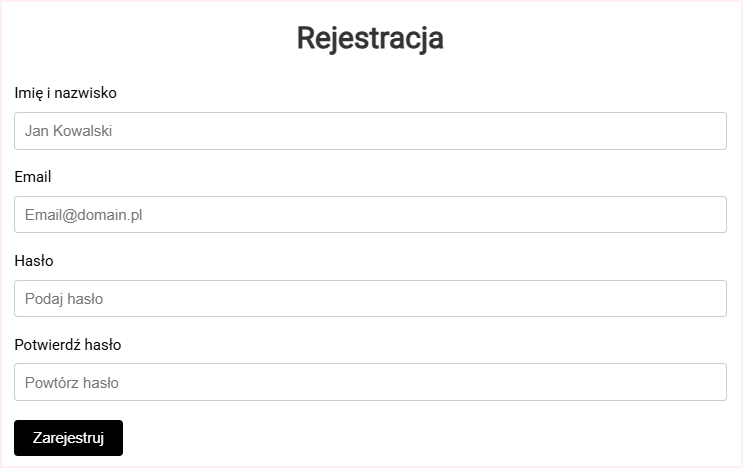
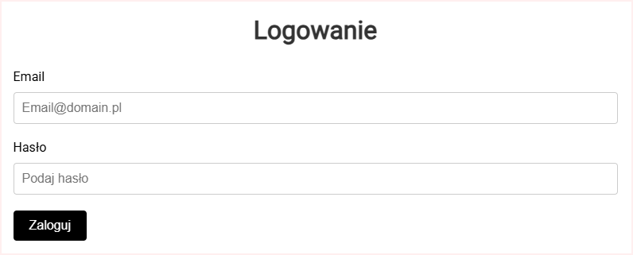

# Testy

## Wstęp

Testy zostały przeprowadzone w celu zapewnienia poprawności działania aplikacji zarówno na poziomie interfejsu użytkownika, jak i komunikacji z serwerem. Wykorzystano narzędzie **Postman** do testowania API oraz mechaniczne testy manualne do sprawdzania funkcjonalności frontendowych.

---

## Testy w Postman

**Postman** to narzędzie służące do testowania interfejsów API, które umożliwia wysyłanie zapytań HTTP, takich jak `GET`, `POST`, `PUT` czy `DELETE`. Umożliwia ono analizowanie odpowiedzi serwera oraz łatwe zarządzanie scenariuszami testowymi w różnych środowiskach. Dzięki intuicyjnemu interfejsowi i wsparciu dla automatyzacji, Postman jest idealnym narzędziem do testowania komunikacji między frontendem a backendem.

Poniżej miejsce na dodanie screenów i opisów przeprowadzonych testów w Postman:

### Wyniki testów API

_(Dodaj tutaj swoje screeny i opisy testów)_

---

## Testy mechaniczne frontendu

W ramach testów manualnych przetestowano kluczowe funkcjonalności aplikacji, takie jak formularze, mapa, zgłaszanie cen paliw oraz proces logowania. Poniżej lista przeprowadzonych testów wraz z opisem oczekiwanych rezultatów:

### Lista testów:

1. **Formularz rejestracji**:
    - Pole `email` akceptuje tylko poprawny format (musi zawierać znak `@`).
    - Hasło musi mieć co najmniej 14 znaków.
    - Potwierdzenie hasła musi być identyczne z polem `hasło`.
    - Pola nie mogą być puste.

    - 
2. **Formularz logowania**:
    - Pole `email` sprawdza poprawność formatu.
    - Walidacja, czy hasło i email pasują do istniejącego użytkownika.
    - Obsługa błędnych danych (np. komunikat o niepoprawnym haśle).

3. **Mapa stacji paliw**:
    - Wyświetlanie wszystkich stacji na mapie na podstawie danych API.
    - Dynamiczne filtrowanie stacji według wybranej marki.
    - Kliknięcie na marker wyświetla szczegóły stacji.
    - Skalowanie mapy nie powoduje błędów w wyświetlaniu markerów.

4. **Formularz zgłaszania cen paliw**:
    - Pole `cena` akceptuje tylko wartości numeryczne większe od zera.
    - Zdjęcie można załadować tylko w formacie JPG, PNG.
    - Lokalizacja stacji jest automatycznie uzupełniana.
    - Pole paliwa wymaga wyboru typu (benzyna, diesel, LPG).

5. **Dashboard użytkownika**:
    - Wyświetlanie poprawnej liczby punktów.
    - Lista ulubionych stacji aktualizuje się po dodaniu/usunięciu stacji.
    - Historia działań pokazuje ostatnie zgłoszenia użytkownika.

6. **Interakcje w menu nawigacyjnym**:
    - Przekierowanie działa poprawnie dla wszystkich sekcji (np. Dashboard, Moje dane, Wyloguj).

7. **Filtrowanie stacji paliw**:
    - Filtry działają poprawnie dla każdej kombinacji (np. marka + cena + rodzaj paliwa).
    - Zastosowanie filtra automatycznie aktualizuje mapę i listę stacji.

8. **System zgłoszeń błędów**:
    - Prawidłowe wyświetlanie komunikatów błędów (np. brak wyników, błąd serwera).

9. **Responsywność aplikacji**:
    - Aplikacja działa poprawnie na różnych urządzeniach (mobile, desktop).

10. **System nagradzania użytkowników**:
    - Punkty są przyznawane tylko za zaakceptowane zgłoszenia cen paliw.

11. **Walidacja danych użytkownika**:
    - Pola edycji danych (imię, email) sprawdzają poprawność wprowadzonych wartości.

12. **Sesje użytkownika**:
    - Automatyczne wylogowanie po określonym czasie bezczynności.

13. **Dynamiczne ładowanie danych**:
    - Dashboard automatycznie pobiera nowe dane po aktualizacji przez API.

14. **Dodawanie ulubionych stacji**:
    - Dodanie stacji do ulubionych odzwierciedla się w Dashboardzie.

15. **Usuwanie zgłoszeń cen paliw**:
    - Użytkownik może usuwać swoje zgłoszenia cen paliw.

16. **Integracja mapy z API**:
    - Mapy wyświetlają stacje zgodnie z danymi pobranymi z serwera.

17. **Filtrowanie po dacie aktualizacji cen**:
    - Użytkownik może filtrować stacje według daty ostatniej aktualizacji.

18. **Obsługa błędnych zapytań API**:
    - W przypadku błędu serwera wyświetla się odpowiedni komunikat.

19. **Tryb nocny**:
    - Aplikacja poprawnie zmienia tryb kolorów po włączeniu trybu nocnego.

20. **Linki i przyciski**:
    - Wszystkie linki i przyciski w aplikacji prowadzą do właściwych sekcji i działają poprawnie.

---

